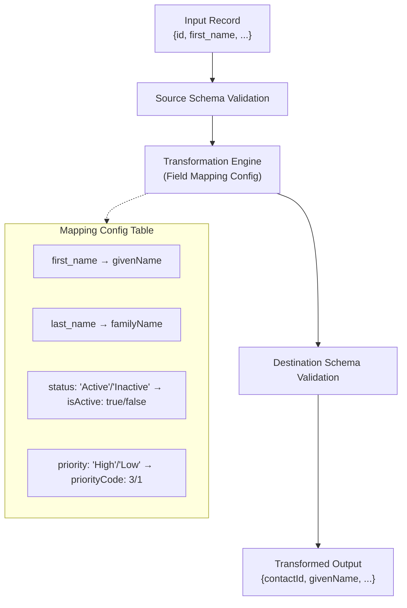

# Design Document: Schema Transformation & Validation Engine

## Problem Framing & Assumptions

The business requires a **record-by-record, bi-directional synchronization engine** that can reliably transfer and map data between an internal system (System A) and various external CRM platforms (System B), handling CRUD events. Each system can have **different data models and schema requirements**. All data transfers must pass **strict schema validation** and support **custom mapping rules**, with the ability to easily add or alter mappings/configs for new fields or providers.

**Assumptions:**
- Source and destination object structures can differ significantly (field names, types, permissible values)
- All input and output data must be validated according to JSON Schema (draft-07)
- The service must be extensible to support additional object types and CRM models with minimal code changes
- Data mapping/transformation is always at the single-record level
- Extensibility, correctness, and auditability are paramount

---

## Alternatives Explored

**1. Hardcoded Struct-to-Struct Mappers**
- **Pros:** Fast, type-safe
- **Cons:** Not maintainable/extensible as schemas evolve; brittle for multi-CRM.

**2. Reflection-based Automatic Mapping**
- **Pros:** Less boilerplate for similar fields
- **Cons:** Poor handling of field renames, type changes, enum conversions

**3. Table/Config-Driven Mapping with Pluggable Logic** (**Chosen**)
- **Pros:** Extremely flexible—maps can be driven by config, not code; handles field renames, enum mapping, type casting; easy to maintain; new CRMs supported by new configs and schemas only
- **Cons:** Slightly more setup, but pays off with extensibility and maintainability

---

## Chosen Design

### High-Level Flow
```
[Input Record] → [Source Schema Validation]
      ↓
[Config-Driven Field Mapping: Renames, Value/Enum/Type Transforms]
      ↓
[Target Schema Validation] → [Transformed Output]
```

### Key Components

1. **Field Mapping Configuration**
    - For each object type, a list of how source fields map to target fields, supporting:
        - Field renames
        - Enum-to-enum mappings (string-to-string)
        - Enum-to-bool/bool-to-enum (string ↔ bool)
        - Enum-to-int/int-to-enum (string ↔ int)
        - Direct assignment

2. **Schema Validation (Input & Output)**
    - Uses [qri-io/jsonschema](https://github.com/qri-io/jsonschema), supporting draft-07
    - Enforces structural and value correctness before and after mapping

3. **Transform Engine**
    - Iterates over all mapping rules
    - For each rule, applies the correct mapping or type conversion based on config
    - Supports easy addition of new mapping patterns if business needs change

4. **Extensibility**
    - Adding support for new systems or fields involves only updating/adding schema and mapping config files, not code

## Example: "Customer" Object

**Internal**:
- Fields: `id`, `first_name`, `last_name`, `email`, `status` (string enum), `priority` (enum string)

**External**:
- Fields: `contactId`, `givenName`, `familyName`, `emailAddress`, `isActive` (bool), `priorityCode` (int)

**Mapping configuration** expresses exactly how to convert, even when types differ (e.g., `"priority": "High"` ↔ `priorityCode: 3`).


